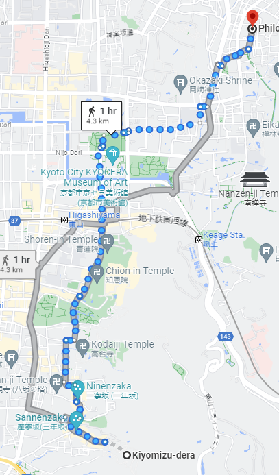

public:: true

- Nov24 2023 - Dec 12 2023
- Singapore to Osaka (Nov 24)
- Tokyo to Singapore (Dec 12)
- # [[Itinerary]]
	- ## [[Day1 - Nov24]]
		- ### Singapore -> Osaka -> Himeji
		- Take off 🛫 24th Nov 8.30 AM SGT (+8) from Changi International Airport
		- Arrival 🛬 24th Nov 3.50 PM JST (+9) at Osaka Kansai International airport
		- Spend the rest of the Day getting to Himeji from Osaka and rest at Himeji.
		- TODO Include details about the Trains to catch to reach Himeji
		- TODO Book Stay at Himeji for 24 - 26 Nov (2 nights, 3 days). Near Himeji Station/Himeji Castle would be good as they are close by.
	- ## [[Day2 - Nov25]]
		- ### **Explore Himeji**
		- ### **Main attraction: Himeji Castle**
			- 
			- Will take around 1-2 hours
		- ### **Koko-en gardens**
			- 
			- Less than 1 hour is enough
			- This is the garden for Himeji castle so they are close by
			- In total for both we could spend the entire morning till lunch time
		- ### **Shoshazan Engyoji**
			- Temple featured in the movie Last Samurai
			- 
			- Take bus number 8 from Himeji Station (North Exit) or Himeji Castle to the terminal stop "Mount Shosha Ropeway" (書写山ロープウェイ, 30 minutes, 280 yen one way, every 20 minutes). Then, take the ropeway up the mountain (600 yen one way, 1000 yen round trip, every 15 minutes)
			- 
			- There exists a convenient combination ticket that includes a round trip by bus from Himeji Station to the ropeway station and the ropeway round trip for 1420 yen. It is available at the ticket counter of the Shinki Bus Terminal in front of Himeji Station.
	- ## [[Day3 - Nov26]]
		- ### **Explore Hiroshima - Okayama - Miyajima**
			- Himeji -> Hiroshima takes 1hr 15mins in Shinkansen
				- Can take Sanyo Shinkansen
				- First train starts as early as 6.40 AM
			- ### **Peace Memorial Park**
				- 
				- From Hiroshima Station, take tram line 2 or 6 to the Genbaku-Domu Mae (原爆ドーム前) stop. The ride takes 15 minutes and costs 220 yen one way. Alternatively, the Peace Memorial Park is served by the [Hiroshima Sightseeing Loop Bus](https://www.japan-guide.com/e/e3404.html) (Meipuru-pu).
			- ### **Itsukushima Shrine**
				- 
				- Travel from Hiroshima to Miyajima
					- To reach the ferry port from Hiroshima Station, take the JR Sanyo Line to Miyajimaguchi Station (25 minutes, 420 yen one way, covered by the Japan Rail Pass).
					- From Miyajimaguchi Station, it is a short walk to the ferry pier, from where ferries depart frequently for Miyajima. There are two competing ferry companies operating from this port: JR and Matsudai. Both companies' ferry rides take 10 minutes and both cost 200 yen one way (excluding visitor tax). The Japan Rail Pass is valid on JR ferries.
				- Both of these can be our morning stuff to see and then we turn back to Okayama on the way. We could do it the other way around as well. Okayama morning and Hiroshima in the evening
			- ### **Okayama Castle + Koraku en**
				- but Kenroku en gardens are most celebrated out of 3. Other one is Kairaku en
				- Hiroshima to Okayama is around 1 hour in Shinkansen
				- Okayama Castle is about 1.5 kilometers or a 25-30 minute walk east of Okayama Station. Trams on the Higashiyama Line can be taken to Shiroshita stop (5 minutes, 120 yen, frequent departures) from where the castle keep can be reached in a 10-15 minute walk.
				- The Koraku en surrounds the castle
				- 
		- Leave to stay the night at Osaka
			- There are a few options covered on JR pass for Himeji to Osaka
			- The last train is around 10.30-11 PM. So we could finish dinner at Himeji and then take the train to Osaka to just sleep for the night
		- TODO Book stay in Osaka from Nov 26 - Dec 2 (6 nights and 7 days). Preferably near Shin-Osaka or Umeda Stations
	- ## [[Day4 - Nov27]]
		- ### **Osaka -> Koyasan**
		- This is not covered in JRPass
		- Koyasan is most conveniently accessed by Nankai Railway from Osaka's Namba or Shin-Imamiya stations. Take the Nankai Koya Line from either station to the Gokurakubashi terminal station. A few limited express trains operate directly to Gokurakubashi (80 minutes, 1720 yen, every 1-3 hours). Otherwise take an express or rapid express train (100 minutes, 930 yen, every 20-30 minutes), most of which require a transfer at Hashimoto Station along the way.
		- At Gokurakubashi, transfer to the cablecar which travels up the mountain to Koyasan. The ride takes about five minutes and costs 500 yen. From the top station, it is a ten minute bus ride into the town center (300 yen to Senjuinbashi bus stop). Note that it is not permitted to walk along the street which connects the cablecar station with the town center.
		- 
		- To save money consider using the [Koyasan World Heritage Ticket](https://www.japan-guide.com/e/e2358_012.html) or [Kansai Thru Pass](https://www.japan-guide.com/e/e2357_005.html).
		- Main attraction is **Okunoin temple** but there are a few places to also see
			- The town of Koyasan is relatively flat and many of its attractions are easily explored on foot. Most of the sites, including the Garan, Kongobuji and the Reihokan Museum are located in the town center, a short walk away from the Senjuinbashi intersection. Among the main attractions, only Okunoin stands outside of the town center at the eastern end of the town. At the western end of the town stands Daimon Gate, the traditional point of entry to Koyasan.
			- 
		- ### **Okunoin Temple**
			- Temple where Kobo Daishi is enshrined
			- 
			- [Okunoin Guide](https://www.japan-guide.com/e/e4901.html)
		- We can return early and rest as the next day is packed
	- ## [[Day5 - Nov28]]
		- ### **Osaka -> Kyoto Day 1**
			- Tokaido Shinkansen line (15 mins)
			- Day 1 in Kyoto is packed with a lot of walking and hiking
		- ### **Tokufuji Temple**
			- 
			- In autumn, people come from all over Japan to see Tofukuji's autumn colors. The most popular view is of the Tsutenkyo Bridge, which spans a valley of lush maple trees. The view from the bridge is equally spectacular, and the 100 meter long, covered walkway becomes extremely crowded when the colors reach their peak, usually around mid to late November.
			- Tofukuji is a ten minute walk from Tofukuji Station on the JR Nara Line (2 minutes, 150 yen from Kyoto Station) and the Keihan Main Line
			- 
		- ### **Fushimi Inari Taisha (Senbon Torii)**
			- 
			- Fushimi Inari Shrine is located just outside JR Inari Station, the second station from Kyoto Station along the JR Nara Line (5 minutes, 150 yen one way from Kyoto Station, not served by rapid trains). The shrine can also be reached in a short walk from Fushimi Inari Station along the Keihan Main Line.
				- Tokufuji and Fushimi Inari are next stops. See the Route map for Tokufuji
			- The hike to the summit of the mountain and back takes about 2-3 hours, however, visitors are free to walk just as far as they wish before turning back
			- After about a 30-45 minute ascent and a gradual decrease in the density of torii gates, visitors will reach the Yotsutsuji intersection roughly half way up the mountain, where some nice views over Kyoto can be enjoyed, and the trail splits into a circular route to the summit. Many hikers only venture as far as here, as the trails do not offer much variation beyond this point and the gate density decreases further.
		- We can break for lunch for the day back at Kyoto station and then go north for Kiyomizu dera
		- ### **Kiyomizu-dera**
			- 
			- Kiyomizudera can be reached from Kyoto Station by bus number 206 (15 minutes, 230 yen). Get off at Gojo-zaka or Kiyomizu-michi bus stop, from where it is a ten minute uphill walk to the temple.
			- 
		- ### **Hagashiyama district**
			- Preserved historic district around Kiyomizudera
			- It is a great place to experience traditional old Kyoto, especially between Kiyomizudera and Yasaka Shrine, where the narrow lanes, wooden buildings and traditional merchant shops invoke a feeling of the old capital city.
			- District between Kiyomizudera and Yasaka Shrine is only about two kilometers long and could be done in half an hour
			- Good walkers are likely to enjoy walking beyond Yasaka Shrine past Chionin and Shorenin to Heian Shrine and possibly as far as Ginkakuji Temple via Nanzenji and the Philosopher's Path.
				- Kiyomizu-dera to Ginkakuji will be 1 hour walk
					- 
				- **Ginkakuji** is the Silver Pavilion corresponding to Kinkajuji (Golden Pavilion) we will visit the next day
					- 
				- **Philosopher's path** would be beautiful with autumn leaves and colors
					- 
					- 
	- ## [[Day6 - Nov29]]
		- Kinkaku-ji
	- [[Day7- Nov30]]
		- Osaka -> Nara
		- Nara Park (Deers)
		- Kofukuji Temple
		- Todaiji Temple
	- [[Day8 - Dec1]]
		- Chill day in Osaka
		- Osaka Castle
		- Sky Umeda building
		- Abeno Harukas
		- Shinsekai
		- Dotonbori
	- [[Day9 - Dec2]]
		- Osaka -> Kanazawa
		- Use luggage storage -> See Kenroku-en (Best Garden in Japan. Hoping to be good for autumn)
		- Travel to Tokyo
		- Should stay near Shinjuku or Shibuya
	- Tokyo and around for the rest of the days. We can switch days around as we see fit
	- [[Day10 - Dec3]]
		- Tokyo to Hakone day trip for Fujisan
		- Drink Amakaze
		- Moto - Hakone -> See Hakone Jinja shrine (lake tori gate)
		- Pirate Ship cruise (Lake ashi)
		- Owakudani (Active volcano - black boiled egg and charcoal ice cream etc)
	- [[Day11 - Dec4]]
		- Tokyo to Kawaguchiko
		- One of Five lakes of Fuji. Take [Fuji excursion train](https://www.jrailpass.com/blog/fuji-excursion-train)
		- Some of the best views of Mount Fuji
	- [[Day12 - Dec5]]
		- WB studios Harry potter the making tour (3-4 hours recommended)
		- Can rest in the morning and do it a bit late in the evening
	- [[Day13 - Dec6]]
		- DisneySea - Only one DisneySea in the world and its in Tokyo.
		- https://thetravelintern.com/ultimate-tokyo-disneyland-and-disneysea-guide/
	- [[Day14 - Dec7]]
		- Ghibli Museum (4 hours recommended)
		- Can make it a chill day to combine with something
	- [[Day15 - Dec8]]
		- Asakusa
		- Tokyo Skytree
		- Senso ji temple
		- Ueno Park (good for Autumn leaves)
	- [[Day16 - Dec9]]
		- Akihabara
			- I will spend whole day here if allowed UwU
		- Tokyo Imperial Garden
			- Good for autumn leaves
		- Koishikawa Korakuen
			- Another autumn leaves garden
	- [[Day17 - Dec10]]
		- Shibuya
			- Crossing
			- Hachiko
		- Harajuku (another Manga area)
		- Omotesando (Shopping centre)
		- Yoyogi park (another autumn leaves spot)
	- [[Day18 - Dec11]]
		- Shinjuku
		- Shinjuku Gyoen (autumn leaves)
		- Metropolitan Govt building
	- [[Day19 - Dec12]]
		- Tokyo -> Singapore