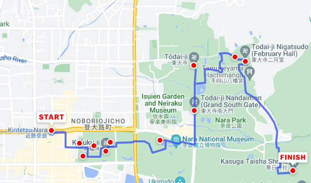
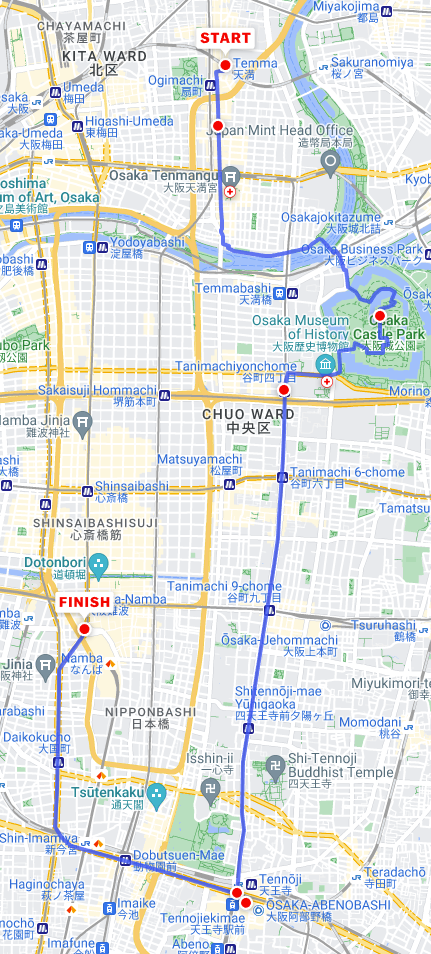

public:: true

- Nov24 2023 - Dec 12 2023
- Singapore to Osaka (Nov 24)
- Tokyo to Singapore (Dec 12)
- # [[Itinerary]]
	- ## [[Day1 - Nov24]]
	  collapsed:: true
		- ### Singapore -> Osaka -> Himeji
		- Take off 🛫 24th Nov 8.30 AM SGT (+8) from Changi International Airport
		- Arrival 🛬 24th Nov 3.50 PM JST (+9) at Osaka Kansai International airport
		- Spend the rest of the Day getting to Himeji from Osaka and rest at Himeji.
		- TODO Include details about the Trains to catch to reach Himeji
		- TODO Book Stay at Himeji for 24 - 26 Nov (2 nights, 3 days). Near Himeji Station/Himeji Castle would be good as they are close by.
	- ## [[Day2 - Nov25]]
	  collapsed:: true
		- ### **Explore Himeji**
		- ### **Main attraction: Himeji Castle**
			- 
			- Will take around 1-2 hours
		- ### **Koko-en gardens**
			- 
			- Less than 1 hour is enough
			- This is the garden for Himeji castle so they are close by
			- In total for both we could spend the entire morning till lunch time
		- ### **Shoshazan Engyoji**
			- Temple featured in the movie Last Samurai
			- 
			- Take bus number 8 from Himeji Station (North Exit) or Himeji Castle to the terminal stop "Mount Shosha Ropeway" (書写山ロープウェイ, 30 minutes, 280 yen one way, every 20 minutes). Then, take the ropeway up the mountain (600 yen one way, 1000 yen round trip, every 15 minutes)
			- 
			- There exists a convenient combination ticket that includes a round trip by bus from Himeji Station to the ropeway station and the ropeway round trip for 1420 yen. It is available at the ticket counter of the Shinki Bus Terminal in front of Himeji Station.
	- ## [[Day3 - Nov26]]
		- ### **Explore Hiroshima - Okayama - Miyajima**
			- Himeji -> Hiroshima takes 1hr 15mins in Shinkansen
				- Can take Sanyo Shinkansen
				- First train starts as early as 6.40 AM
			- ### **Peace Memorial Park**
				- 
				- From Hiroshima Station, take tram line 2 or 6 to the Genbaku-Domu Mae (原爆ドーム前) stop. The ride takes 15 minutes and costs 220 yen one way. Alternatively, the Peace Memorial Park is served by the [Hiroshima Sightseeing Loop Bus](https://www.japan-guide.com/e/e3404.html) (Meipuru-pu).
			- ### **Itsukushima Shrine**
				- 
				- Travel from Hiroshima to Miyajima
					- To reach the ferry port from Hiroshima Station, take the JR Sanyo Line to Miyajimaguchi Station (25 minutes, 420 yen one way, covered by the Japan Rail Pass).
					- From Miyajimaguchi Station, it is a short walk to the ferry pier, from where ferries depart frequently for Miyajima. There are two competing ferry companies operating from this port: JR and Matsudai. Both companies' ferry rides take 10 minutes and both cost 200 yen one way (excluding visitor tax). The Japan Rail Pass is valid on JR ferries.
				- Both of these can be our morning stuff to see and then we turn back to Okayama on the way. We could do it the other way around as well. Okayama morning and Hiroshima in the evening
			- ### **Okayama Castle + Koraku en**
				- but Kenroku en gardens are most celebrated out of 3. Other one is Kairaku en
				- Hiroshima to Okayama is around 1 hour in Shinkansen
				- Okayama Castle is about 1.5 kilometers or a 25-30 minute walk east of Okayama Station. Trams on the Higashiyama Line can be taken to Shiroshita stop (5 minutes, 120 yen, frequent departures) from where the castle keep can be reached in a 10-15 minute walk.
				- The Koraku en surrounds the castle
				- 
		- Leave to stay the night at Osaka
			- There are a few options covered on JR pass for Himeji to Osaka
			- The last train is around 10.30-11 PM. So we could finish dinner at Himeji and then take the train to Osaka to just sleep for the night
		- TODO Book stay in Osaka from Nov 26 - Dec 2 (6 nights and 7 days). Preferably near Shin-Osaka or Umeda Stations
	- ## [[Day4 - Nov27]]
		- ### **Osaka -> Koyasan**
		- This is not covered in JRPass
		- Koyasan is most conveniently accessed by Nankai Railway from Osaka's Namba or Shin-Imamiya stations. Take the Nankai Koya Line from either station to the Gokurakubashi terminal station. A few limited express trains operate directly to Gokurakubashi (80 minutes, 1720 yen, every 1-3 hours). Otherwise take an express or rapid express train (100 minutes, 930 yen, every 20-30 minutes), most of which require a transfer at Hashimoto Station along the way.
		- At Gokurakubashi, transfer to the cablecar which travels up the mountain to Koyasan. The ride takes about five minutes and costs 500 yen. From the top station, it is a ten minute bus ride into the town center (300 yen to Senjuinbashi bus stop). Note that it is not permitted to walk along the street which connects the cablecar station with the town center.
		- 
		- To save money consider using the [Koyasan World Heritage Ticket](https://www.japan-guide.com/e/e2358_012.html) or [Kansai Thru Pass](https://www.japan-guide.com/e/e2357_005.html).
		- Main attraction is **Okunoin temple** but there are a few places to also see
			- The town of Koyasan is relatively flat and many of its attractions are easily explored on foot. Most of the sites, including the Garan, Kongobuji and the Reihokan Museum are located in the town center, a short walk away from the Senjuinbashi intersection. Among the main attractions, only Okunoin stands outside of the town center at the eastern end of the town. At the western end of the town stands Daimon Gate, the traditional point of entry to Koyasan.
			- 
		- ### **Okunoin Temple**
			- Temple where Kobo Daishi is enshrined
			- 
			- [Okunoin Guide](https://www.japan-guide.com/e/e4901.html)
		- We can return early and rest as the next day is packed
	- ## [[Day5 - Nov28]]
		- ### **Osaka -> Kyoto Day 1**
			- Tokaido Shinkansen line (15 mins)
			- Day 1 in Kyoto is packed with a lot of walking and hiking
		- ### **Tokufuji Temple**
			- 
			- In autumn, people come from all over Japan to see Tofukuji's autumn colors. The most popular view is of the Tsutenkyo Bridge, which spans a valley of lush maple trees. The view from the bridge is equally spectacular, and the 100 meter long, covered walkway becomes extremely crowded when the colors reach their peak, usually around mid to late November.
			- Tofukuji is a ten minute walk from Tofukuji Station on the JR Nara Line (2 minutes, 150 yen from Kyoto Station) and the Keihan Main Line
			- 
		- ### **Fushimi Inari Taisha (Senbon Torii)**
			- 
			- Fushimi Inari Shrine is located just outside JR Inari Station, the second station from Kyoto Station along the JR Nara Line (5 minutes, 150 yen one way from Kyoto Station, not served by rapid trains). The shrine can also be reached in a short walk from Fushimi Inari Station along the Keihan Main Line.
				- Tokufuji and Fushimi Inari are next stops. See the Route map for Tokufuji
			- The hike to the summit of the mountain and back takes about 2-3 hours, however, visitors are free to walk just as far as they wish before turning back
			- After about a 30-45 minute ascent and a gradual decrease in the density of torii gates, visitors will reach the Yotsutsuji intersection roughly half way up the mountain, where some nice views over Kyoto can be enjoyed, and the trail splits into a circular route to the summit. Many hikers only venture as far as here, as the trails do not offer much variation beyond this point and the gate density decreases further.
		- We can break for lunch for the day back at Kyoto station and then go north for Kiyomizu dera
		- ### **Kiyomizu-dera**
			- 
			- Kiyomizudera can be reached from Kyoto Station by bus number 206 (15 minutes, 230 yen). Get off at Gojo-zaka or Kiyomizu-michi bus stop, from where it is a ten minute uphill walk to the temple.
			- 
		- ### **Hagashiyama district**
			- Preserved historic district around Kiyomizudera
			- It is a great place to experience traditional old Kyoto, especially between Kiyomizudera and Yasaka Shrine, where the narrow lanes, wooden buildings and traditional merchant shops invoke a feeling of the old capital city.
			- District between Kiyomizudera and Yasaka Shrine is only about two kilometers long and could be done in half an hour
			- Good walkers are likely to enjoy walking beyond Yasaka Shrine past Chionin and Shorenin to Heian Shrine and possibly as far as Ginkakuji Temple via Nanzenji and the Philosopher's Path.
				- Kiyomizu-dera to Ginkakuji will be 1 hour walk
					- 
				- **Ginkakuji** is the Silver Pavilion corresponding to Kinkajuji (Golden Pavilion) we will visit the next day
					- 
				- **Philosopher's path** would be beautiful with autumn leaves and colors
					- 
					- 
	- ## [[Day6 - Nov29]]
		- ### **Osaka -> Kyoto Day 2**
		- ### **Arashiyama bamboo forest**
			- Should target early morning to avoid crowd and return back to Arashiyama for Lunch
			- The fastest access from Kyoto Station to Arashiyama is provided by the JR Sagano Line (also known as JR Sanin Line included in JRPass). The one way ride to Saga-Arashiyama Station takes 15 minutes and costs 240 yen. From the station it is a 5-10 minute walk to central Arashiyama.
			- 
			- https://www.japan-guide.com/g19/2158_west_1903.gif
			- The Togetsukyo Bridge is Arashiyama's well known, central landmark. Many small shops, restaurants and other attractions are found nearby, including Tenryuji Temple, Arashiyama's famous bamboo groves and pleasure boats that are available for rent on the river.
			- Arashiyama becomes most attractive (and busy) around early April and the second half of November when the cherry blossom and fall color seasons usually peak
		- ### **Sagano romantic train - Hozu River Boat Tour**
			- The Sagano Scenic Railway (嵯峨野観光鉄道, also known as the Sagano Romantic Train or Sagano Torokko) is a sightseeing train line that runs along the Hozugawa River between Arashiyama and Kameoka. Its charming, old-fashioned trains wind their way through the mountains at a slow pace, taking about 25 minutes to make the seven kilometer journey and giving passengers pleasant views of the scenery as they travel from Arashiyama through the forested ravine and into rural Kameoka.
			- The train is particularly popular during the autumn color season from mid November to early December when the leaves along the ravine change color.
			- Tickets can be purchased at Torokko Saga Station or at JR ticket offices in the Kansai Region or online through Klook
			- Travelers combine the sightseeing train with a Hozugawa River Cruise back to Arashiyama
			- The boats take about two hours to leisurely make their way down the river and are a relaxing way to see the natural scenery of the largely undeveloped ravine.
			- Can buy the cruise ticket on Klook as well
			- 
			- https://www.japan-guide.com/g7/torokko_hozugawa_map_01.gif
		- ### Kinkaku ji (Golden Pavilion)
			- Need to return from Arashiyama back to Kyoto and then travel towards Kinkaku ji
			- 
			- https://www.japan-guide.com/g18/3908_top.jpg
			- Kinkakuji can be accessed from Kyoto Station by direct Kyoto City Bus number 205 in about 40 minutes and for 230 yen. Alternatively, it can be faster and more reliable to take the Karasuma Subway Line to Kitaoji Station (15 minutes, 260 yen) and a taxi (10 minutes, about 1300 yen) or bus (10 minutes, 230 yen, bus numbers 204 or 205) from there to Kinkakuji.
	- ## [[Day7- Nov30]]
		- ### **Osaka -> Nara**
			- [Nara Park itinerary video](https://youtu.be/Kbz3E1INyVw)
			- Exploring Nara also involves walking
			- Multiple Yamatoji rapid trains operate every hour between Osaka (JR Osaka Station) and Nara (JR Nara Station). The one way trip takes 45 minutes, costs 820 yen and is covered by the Japan Rail Pass.
				- But we need to reach Kintetsu Nara Station for a close walk to the Park
			- [Guide for Nara Full Day walk](https://www.japan-guide.com/e/e4119_nara_full.html). This is supposed to be 7 hours spent in Nara park but once we enter Nara Park we can explore at our own leisure
			- 
			- Main Atrractions
				- **Kofukuji Temple**
				- **Todaiji Temple**
				- **Nara Deers**
				- **Kasuga Taisha**
	- ## **[[Day8 - Dec1]]**
		- ### **Osaka -> Kanazawa**
			- We do kanazawa in the middle of 2 walking tours so that we can give ourselves some rest
			- JR Thunderbird limited express trains provide one or two direct connections per hour between Osaka and Kanazawa. The one way journey takes 2.5 hours and costs 7260 yen for a non-reserved seat or about 7790 yen for a reserved seat. It is fully covered by the Japan Rail Pass.
				- This is a to-and-fro travel, 2.5 hours each, from Osaka, just to see a garden. So we can consider skipping this altogether
				- Instead we could spend 2 days in Osaka city and exploring around
			- 
		- ### **Kenroku-en (Best Garden in Japan)**
			- There are some JR buses which connect Kanazawa Station with Kenrokuen and the Higashi Chaya District. The buses are covered by the Japan Rail Pass
			- 
			- In autumn you can see fall colors, which are mainly provided by the cherry and maple trees and usually change colors from around mid November to early December. The orange and red maples are mostly found near Yamazakiyama on the garden's eastern side near the Kodatsuno Gate
	- ## **[[Day9 - Dec2]]**
		- Just like Nara we can do **Osaka city walk**
		- 
		- [Osaka Full Day itineray](https://www.japan-guide.com/e/e4028_osaka_eclectic.html) covers a 7 hour walking tour around the city covering major attractions
		- Main attractions
			- **Osaka Castle**
			- **Sky Umeda building**
			- **Abeno Harukas**
			- **Shinsekai**
			- **Dotonbori**
		- We take a train in the evening or night and reach Tokyo to rest
		- Tokyo and around for the rest of the days. We can switch days around as we see fit
		- TODO Book Stay in Tokyo near Shinjiku or Shibuya areas from Dec 2 - Dec 12 (10 nights, 11 days)
	- ## **[[Day10 - Dec3]]**
		- ### **Tokyo to Hakone day trip for Fujisan**
		- 
		- **By Odakyu Railway**
			- Odakyu Railway operates between Tokyo's Shinjuku Station and Hakone-Yumoto Station. The one way journey by the "Romance Car" limited express takes about 85 minutes and costs 2470 yen (or 2420 yen if using an e-ticket). By slower express trains (kyuko), the journey takes about two hours, requires one transfer at Odawara, but costs only 1270 yen.
			- Odakyu also offers the Hakone Free Pass, which includes the round trip from Tokyo to Hakone and unlimited use of selected trains, cablecars, ropeways, boats and buses in the Hakone area.
		- **By JR (Japan Railways)**
			- With JR trains you can only get as far as Odawara, from where you will have to use non-JR trains or buses into the Hakone area. The above mentioned Hakone Free Pass is also available for use from Odawara Station.
			- By JR Tokaido Shinkansen you can access Odawara in about half an hour from Tokyo or Shinagawa Station (about 3500 yen one way, fully covered by the Japan Rail Pass). Note that only Kodama trains and selected Hikari trains stop at Odawara Station.
			- Alternatively, you can access Odawara from Tokyo in about 70-90 minutes by local or rapid trains on the JR Tokaido Main Line (stopping at Tokyo, Shimbashi and Shinagawa Stations) or the JR Shonan Shinjuku Line (stopping at Ikebukuro, Shinjuku and Shibuya Stations) for about 1500 yen one way. These trains are also covered by the Japan Rail Pass.
		- The municipality of Hakone covers a mountainous region with several small towns, among which Moto-Hakone and Hakone-machi at the shores of Lake Ashi and the hot spring town of Hakone-Yumoto down in the valley, are the region's main transportation hubs.
		- An efficient network of buses, trains, cablecars, ropeways and sightseeing boats, as well as some attractive, easy-to-use passes (see below) make Hakone a great place to explore by public transportation. A popular way of seeing Hakone is by circling the region by five different means of transportation, also known as the Hakone Round Course.
		- {:height 427, :width 650}
		- [Day trip from Tokyo to Hakone](https://youtu.be/sQAa7zMFJKE) covers everything we need to do for the trip
		- 
		- We can get the [Hakone free pass](https://www.japan-guide.com/e/e2358_008.html) and fully cover this trip from and to Shijiku Tokyo
		- **Major things to do**
			- Bus from Hakone-Yumoto to Amasake Chaya to drink Amasake
			- Walk to Moto - Hakone -> See Hakone Jinja shrine (lake tori gate)
			- Take Pirate Ship cruise (Lake ashi) to Togendai and then transfer to Ropeway
			- Ropeway to Owakudani (Active volcano - black boiled egg and charcoal ice cream etc)
			- Cable car ride to Gora
			- Train back to Hakone-Yumoto
	- ## **[[Day11 - Dec4]]**
		- ### **Tokyo -> Kawaguchiko**
		- The best views of Mount Fuji can be enjoyed from the lake's northern shores and are particularly breathtaking during the cherry blossom season around mid April and the autumn colors around the first half of November. One of the nicest spots for cherry blossoms is the seaside promenade near the Kawaguchiko Music Forest, while photographers will enjoy the "Momiji Tunnel" for autumn colors, a maple tree covered road section along the lake's northern shore.
		- One of Five lakes of Fuji. Take [Fuji excursion train](https://www.jrailpass.com/blog/fuji-excursion-train)
			- The full journey from Shinjuku Station will only take an hour and 50 minutes marking a huge timesaving for visitors. At the moment, 3 trains run daily on both weekdays and Saturdays and holidays.
			- If you have a Japan Rail Pass you can ride a part of the Fuji Excursion (Shinjuku – Otsuki) without needing an additional ticket. This means that JR Pass holders need to buy a ticket for the ‘Otsuki – Mount Fuji / Fujikyu Highland / Kawaguchiko’ section of the journey
			- The easiest option to access most sights around Kawaguchiko is to make use of the sightseeing buses. There are three main bus lines: Red, Green, and Blue, all departing from Kawaguchiko Station. You can purchase a one-day ticket for all three lake sightseeing buses for ¥1,200 or a two-day ticket for ¥1,500. There are also passes that include the ropeway and sightseeing boat for ¥2,500. IC cards also work on trains and local buses
		- Some of the best views of Mount Fuji. Visibility tends to be best in the early mornings (usually before 9am) and in the late afternoons.
			- 
		- [Tokyo to Kawaguchiko Day trip Guide](https://tokyocheapo.com/entertainment/tokyo-to-kawaguchiko-day-trip-guide/) covers a lot of things to do
	- ## **[[Day12 - Dec5]]**
		- ### **Warner Bros Studios Harry potter The Making Tour**
			- (3-4 hours recommended)
		- 
		- The Warner Bros Studio Tour Tokyo is two minutes on foot from Toshimaen Station, which is served by the Seibu Toshima Line and the Oedo Subway Line.
		- **From Shinjuku Station**
			- Take the Oedo Subway Line from Shinjuku Station and get off at Toshimaen Station (20 minutes, 280 yen one way)
		- Can rest in the morning and do it a bit late in the evening
		- TODO Book tickets for WB studios
	- ## **[[Day13 - Dec6]]**
		- ### **DisneySea**
			- Only one DisneySea in the world and its in Tokyo.
			- 
			- 
		- [DisneySea Guide](https://thetravelintern.com/ultimate-tokyo-disneyland-and-disneysea-guide/)
		- Tokyo Station and Maihama Station are connected by frequent local and rapid trains along the JR Keiyo and JR Musashino Lines. The one way trip takes about 15 minutes, costs 230 yen and is fully covered by the Japan Rail Pass. Note that the JR Keiyo and JR Musashino Lines are about a ten minute walk from the other platforms at Tokyo Station. (Covered by JR Pass)
		- From Maihama Station, take the Disney Resort Monorail to Tokyo Disney Sea Station (10 minutes, 260 yen). Alternatively, you can walk there in about 20 minutes.
		- 
		- TODO Book tickets for DisneySea
	- ## **[[Day14 - Dec7]]**
		- ### **Ghibli Museum**
			- 4 hours recommended
		- 
		- The museum can be reached from Mitaka Station on the JR Chuo Line (15 minutes, 230 yen from Shinjuku Station). There are shuttle buses from the station to the museum (210 yen one way, 320 yen roundtrip, children are half price), while a taxi ride costs about 750 yen one way. Alternatively you can walk to the museum in about 20 minutes from Mitaka Station or from Kichijoji Station through Inokashira Park.
		- Can make it a chill day to combine with something
	- ## **[[Day15 - Dec8]]**
		- Asakusa
		- Tokyo Skytree
		- Senso ji temple
		- Ueno Park (good for Autumn leaves)
	- ## **[[Day16 - Dec9]]**
		- Akihabara
			- I will spend whole day here if allowed UwU
		- Tokyo Imperial Garden
			- Good for autumn leaves
		- Koishikawa Korakuen
			- Another autumn leaves garden
	- ## **[[Day17 - Dec10]]**
		- Shibuya
			- Crossing
			- Hachiko
		- Harajuku (another Manga area)
		- Omotesando (Shopping centre)
		- Yoyogi park (another autumn leaves spot)
	- ## **[[Day18 - Dec11]]**
		- Shinjuku
		- Shinjuku Gyoen (autumn leaves)
		- Metropolitan Govt building
	- ## **[[Day19 - Dec12]]**
		- Tokyo -> Singapore